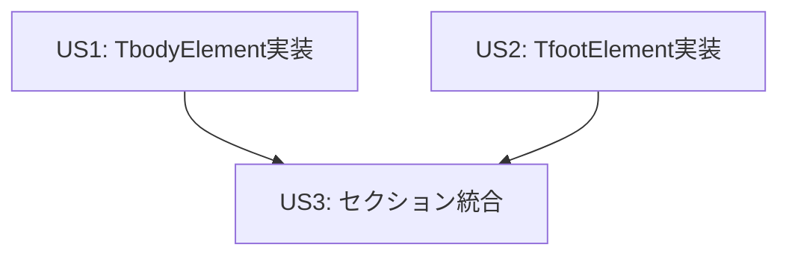

# Implementation Tasks: テーブルセクション（tbody, tfoot）の実装

**Feature**: テーブルセクション（tbody, tfoot）のFigma変換機能
**Branch**: `128-tbody-tfoot-implementation`
**Date**: 2025-11-23
**Spec**: [spec.md](./spec.md)
**Plan**: [plan.md](./plan.md)

## Overview

HTMLテーブルのセクション要素（tbody, tfoot）をFigma FrameNodeに変換する機能を実装します。TDD（テスト駆動開発）に従い、既存のthead要素実装と同じパターンで、高い品質とカバレッジを確保します。

## User Stories

このプロジェクトには以下のユーザーストーリーがあります：

### User Story 1 (US1): TableBodySectionElement実装

**Priority**: P1（最優先）

**Goal**: `<tbody>`要素をFigma FrameNodeに変換し、テーブルのメインコンテンツを適切に表現する

**Acceptance Criteria**:
- TbodyElementがBaseElementを継承し、TrElement[]を子要素として持つ
- create(), isTbodyElement(), toFigmaNode(), mapToFigma()メソッドが実装されている
- Figma変換時にVERTICAL Auto Layoutが適用される
- 単体テスト、統合テストが全てグリーンである
- カバレッジ90%以上を達成している

**Independent Test Criteria**:
```typescript
// tbody要素単独で動作確認
const tbody = TbodyElement.create({ class: "table-body" });
tbody.children = [TrElement.create(), TrElement.create()];
const config = TbodyElement.toFigmaNode(tbody);

expect(config.name).toBe("tbody");
expect(config.layoutMode).toBe("VERTICAL");
expect(tbody.children.length).toBe(2);
```

### User Story 2 (US2): TableFooterSectionElement実装

**Priority**: P2

**Goal**: `<tfoot>`要素をFigma FrameNodeに変換し、テーブルのフッター情報を適切に表現する

**Acceptance Criteria**:
- TfootElementがBaseElementを継承し、TrElement[]を子要素として持つ
- create(), isTfootElement(), toFigmaNode(), mapToFigma()メソッドが実装されている
- Figma変換時にVERTICAL Auto Layoutが適用される
- 単体テスト、統合テストが全てグリーンである
- カバレッジ90%以上を達成している

**Independent Test Criteria**:
```typescript
// tfoot要素単独で動作確認
const tfoot = TfootElement.create({ class: "table-footer" });
tfoot.children = [TrElement.create()];
const config = TfootElement.toFigmaNode(tfoot);

expect(config.name).toBe("tfoot");
expect(config.layoutMode).toBe("VERTICAL");
expect(tfoot.children.length).toBe(1);
```

### User Story 3 (US3): セクション統合

**Priority**: P3

**Goal**: thead/tbody/tfootを含む完全なテーブル構造をサポートし、セクション間の連携を実現する

**Acceptance Criteria**:
- thead/tbody/tfootが視覚的に区別される
- セクション間の境界線処理が適切である
- セクションごとに異なるスタイルを適用可能
- table/index.tsからtbody/tfootがエクスポートされている
- 統合テストが全てグリーンである

**Independent Test Criteria**:
```typescript
// 完全なテーブル構造のテスト
const thead = TheadElement.create();
const tbody = TbodyElement.create();
const tfoot = TfootElement.create();

const theadConfig = TheadElement.toFigmaNode(thead);
const tbodyConfig = TbodyElement.toFigmaNode(tbody);
const tfootConfig = TfootElement.toFigmaNode(tfoot);

// 全てのセクションが独立して動作する
expect(theadConfig.name).toBe("thead");
expect(tbodyConfig.name).toBe("tbody");
expect(tfootConfig.name).toBe("tfoot");
```

## Task Breakdown

### Phase 1: Setup

**Goal**: プロジェクト環境の準備と初期設定

- [ ] T001 既存のthead要素実装を確認し、パターンを理解する

### Phase 2: Foundational

**Goal**: 共通の基盤を整備

- [ ] T002 [P] ディレクトリ構造を作成 (src/converter/elements/table/tbody/, src/converter/elements/table/tfoot/)

### Phase 3: User Story 1 - TableBodySectionElement実装

**Goal**: tbody要素の完全な実装

**Story**: US1

#### 3.1 TbodyAttributes実装

- [ ] T003 [US1] TbodyAttributes型定義のテストを作成 (src/converter/elements/table/tbody/tbody-attributes/__tests__/tbody-attributes.test.ts)
- [ ] T004 [US1] TbodyAttributes型定義を実装 (src/converter/elements/table/tbody/tbody-attributes/tbody-attributes.ts)
- [ ] T005 [US1] TbodyAttributesのindex.tsを作成 (src/converter/elements/table/tbody/tbody-attributes/index.ts)

#### 3.2 TbodyElement実装

- [ ] T006 [US1] TbodyElement.create()のテストを作成 (src/converter/elements/table/tbody/tbody-element/__tests__/tbody-element.factory.test.ts)
- [ ] T007 [US1] TbodyElement.isTbodyElement()のテストを作成 (src/converter/elements/table/tbody/tbody-element/__tests__/tbody-element.typeguards.test.ts)
- [ ] T008 [US1] TbodyElement.toFigmaNode()のテストを作成 (src/converter/elements/table/tbody/tbody-element/__tests__/tbody-element.toFigmaNode.test.ts)
- [ ] T009 [US1] TbodyElement.mapToFigma()のテストを作成 (src/converter/elements/table/tbody/tbody-element/__tests__/tbody-element.mapToFigma.test.ts)
- [ ] T010 [US1] TbodyElement実装を作成 (src/converter/elements/table/tbody/tbody-element/tbody-element.ts)
- [ ] T011 [US1] TbodyElementのindex.tsを作成 (src/converter/elements/table/tbody/tbody-element/index.ts)

#### 3.3 Tbody統合テスト

- [ ] T012 [US1] tbody基本統合テストを作成 (src/converter/elements/table/tbody/__tests__/tbody-integration.basic.test.ts)
- [ ] T013 [US1] tbodyシナリオテストを作成 (src/converter/elements/table/tbody/__tests__/tbody-integration.scenarios.test.ts)
- [ ] T014 [US1] tbodyスタイルテストを作成 (src/converter/elements/table/tbody/__tests__/tbody-integration.styles.test.ts)

#### 3.4 Tbodyエクスポート

- [ ] T015 [US1] tbody/index.tsを作成してエクスポートを集約 (src/converter/elements/table/tbody/index.ts)

#### 3.5 US1検証

- [ ] T016 [US1] US1の全テストを実行してグリーンであることを確認
- [ ] T017 [US1] US1のカバレッジが90%以上であることを確認
- [ ] T018 [US1] US1のLintとType Checkが通ることを確認

### Phase 4: User Story 2 - TableFooterSectionElement実装

**Goal**: tfoot要素の完全な実装

**Story**: US2

#### 4.1 TfootAttributes実装

- [ ] T019 [US2] TfootAttributes型定義のテストを作成 (src/converter/elements/table/tfoot/tfoot-attributes/__tests__/tfoot-attributes.test.ts)
- [ ] T020 [US2] TfootAttributes型定義を実装 (src/converter/elements/table/tfoot/tfoot-attributes/tfoot-attributes.ts)
- [ ] T021 [US2] TfootAttributesのindex.tsを作成 (src/converter/elements/table/tfoot/tfoot-attributes/index.ts)

#### 4.2 TfootElement実装

- [ ] T022 [US2] TfootElement.create()のテストを作成 (src/converter/elements/table/tfoot/tfoot-element/__tests__/tfoot-element.factory.test.ts)
- [ ] T023 [US2] TfootElement.isTfootElement()のテストを作成 (src/converter/elements/table/tfoot/tfoot-element/__tests__/tfoot-element.typeguards.test.ts)
- [ ] T024 [US2] TfootElement.toFigmaNode()のテストを作成 (src/converter/elements/table/tfoot/tfoot-element/__tests__/tfoot-element.toFigmaNode.test.ts)
- [ ] T025 [US2] TfootElement.mapToFigma()のテストを作成 (src/converter/elements/table/tfoot/tfoot-element/__tests__/tfoot-element.mapToFigma.test.ts)
- [ ] T026 [US2] TfootElement実装を作成 (src/converter/elements/table/tfoot/tfoot-element/tfoot-element.ts)
- [ ] T027 [US2] TfootElementのindex.tsを作成 (src/converter/elements/table/tfoot/tfoot-element/index.ts)

#### 4.3 Tfoot統合テスト

- [ ] T028 [US2] tfoot基本統合テストを作成 (src/converter/elements/table/tfoot/__tests__/tfoot-integration.basic.test.ts)
- [ ] T029 [US2] tfootシナリオテストを作成 (src/converter/elements/table/tfoot/__tests__/tfoot-integration.scenarios.test.ts)
- [ ] T030 [US2] tfootスタイルテストを作成 (src/converter/elements/table/tfoot/__tests__/tfoot-integration.styles.test.ts)

#### 4.4 Tfootエクスポート

- [ ] T031 [US2] tfoot/index.tsを作成してエクスポートを集約 (src/converter/elements/table/tfoot/index.ts)

#### 4.5 US2検証

- [ ] T032 [US2] US2の全テストを実行してグリーンであることを確認
- [ ] T033 [US2] US2のカバレッジが90%以上であることを確認
- [ ] T034 [US2] US2のLintとType Checkが通ることを確認

### Phase 5: User Story 3 - セクション統合

**Goal**: thead/tbody/tfootの統合とエクスポート

**Story**: US3

#### 5.1 セクション統合テスト

- [ ] T035 [US3] thead/tbody/tfoot統合テストを作成 (src/converter/elements/table/__tests__/table-sections-integration.test.ts)

#### 5.2 エクスポート統合

- [ ] T036 [US3] table/index.tsにtbody/tfootのエクスポートを追加 (src/converter/elements/table/index.ts)

#### 5.3 US3検証

- [ ] T037 [US3] US3の全テストを実行してグリーンであることを確認
- [ ] T038 [US3] セクション間の連携が正しく動作することを確認
- [ ] T039 [US3] US3のLintとType Checkが通ることを確認

### Phase 6: Polish & Cross-Cutting Concerns

**Goal**: 最終調整とドキュメント更新

- [ ] T040 全テストスイートを実行してグリーンであることを確認
- [ ] T041 全体のカバレッジが90%以上であることを確認
- [ ] T042 全コードのLintとType Checkが通ることを確認
- [ ] T043 既存のtable関連テストが影響を受けていないことを確認

## Dependencies

### User Story Dependencies



**Dependency Order**:
1. US1とUS2は並行実装可能（独立）
2. US3はUS1とUS2の完了後に実装

### Task Dependencies

**Phase 3 (US1) Internal Dependencies**:
- T003-T005（TbodyAttributes）は並行実装不可（順序実行）
- T006-T009（テスト）はT010（実装）の前に作成（TDD）
- T012-T014（統合テスト）はT010（実装）完了後に実行可能
- T016-T018（検証）は全てのUS1タスク完了後

**Phase 4 (US2) Internal Dependencies**:
- T019-T021（TfootAttributes）は並行実装不可（順序実行）
- T022-T025（テスト）はT026（実装）の前に作成（TDD）
- T028-T030（統合テスト）はT026（実装）完了後に実行可能
- T032-T034（検証）は全てのUS2タスク完了後

**Phase 5 (US3) Dependencies**:
- T035-T039はUS1とUS2の完了後に実行

## Parallel Execution Opportunities

### Phase 3 (US1)とPhase 4 (US2)の並行実装

US1とUS2は完全に独立しているため、以下のように並行実装可能：

**並行実行例1: 属性実装**
```bash
# 開発者A: TbodyAttributes実装
T003, T004, T005

# 開発者B: TfootAttributes実装（同時進行可能）
T019, T020, T021
```

**並行実行例2: 要素実装**
```bash
# 開発者A: TbodyElement実装
T006, T007, T008, T009, T010, T011

# 開発者B: TfootElement実装（同時進行可能）
T022, T023, T024, T025, T026, T027
```

**並行実行例3: 統合テスト**
```bash
# 開発者A: Tbody統合テスト
T012, T013, T014

# 開発者B: Tfoot統合テスト（同時進行可能）
T028, T029, T030
```

### TDD内の並行可能性

各テストファイルは独立しているため、以下のテストは並行作成可能：

```bash
# 並行実行可能（同じUS内でもファイルが異なる）
T006 (factory.test.ts)
T007 (typeguards.test.ts)
T008 (toFigmaNode.test.ts)
T009 (mapToFigma.test.ts)
```

ただし、実装（T010）はこれらのテストがすべて作成された後に行う必要があります（TDD原則）。

## Implementation Strategy

### MVP Scope (Minimum Viable Product)

**推奨MVP**: User Story 1のみ

MVPスコープ:
- TbodyElement完全実装（T003-T018）
- 単体テスト + 統合テスト
- カバレッジ90%以上
- 単独で動作確認可能

**MVP完了条件**:
```bash
# US1の全テストがグリーン
npm test -- tbody

# カバレッジ確認
npm run coverage

# Lint & Type Check
npm run lint
npm run type-check
```

**MVP後の拡張**:
1. US2（TfootElement）を追加
2. US3（セクション統合）を追加

### Incremental Delivery

各User Storyは独立してデプロイ可能：

**Iteration 1**: US1完了後
- TbodyElementのみ利用可能
- 既存機能に影響なし

**Iteration 2**: US2完了後
- TbodyElement + TfootElement利用可能
- 各セクション単独で動作

**Iteration 3**: US3完了後
- 完全なテーブル構造サポート
- thead/tbody/tfoot統合

## Testing Strategy

### TDD Workflow

各タスクは以下のTDDサイクルに従います：

1. **Red**: テストを先に書く → 失敗することを確認
2. **Green**: 最小限の実装 → テストが通ることを確認
3. **Refactor**: コードを整理 → テストが通り続けることを確認

**例: T006-T010（TbodyElement.create()）**
```bash
# 1. Red: テストを書く
npm test tbody-element.factory.test.ts  # FAIL

# 2. Green: 実装する
npm test tbody-element.factory.test.ts  # PASS

# 3. Refactor: 整理する
npm test tbody-element.factory.test.ts  # PASS
```

### Test Levels

**単体テスト** (T006-T011, T022-T027):
- create(), isTbodyElement(), toFigmaNode(), mapToFigma()
- 各メソッドの正常系・異常系
- 境界値テスト

**統合テスト** (T012-T014, T028-T030):
- basic: 基本的な機能の動作確認
- scenarios: 実用的なシナリオのテスト
- styles: スタイル適用のテスト

**セクション統合テスト** (T035):
- thead/tbody/tfootの連携
- 複数セクションを含むテーブル
- セクション順序の検証

## Quality Gates

各フェーズ完了時に以下を確認：

### Phase 3完了時（US1）
- [ ] 全テストグリーン（T016）
- [ ] カバレッジ90%以上（T017）
- [ ] Lint & Type Check通過（T018）

### Phase 4完了時（US2）
- [ ] 全テストグリーン（T032）
- [ ] カバレッジ90%以上（T033）
- [ ] Lint & Type Check通過（T034）

### Phase 5完了時（US3）
- [ ] 全テストグリーン（T037）
- [ ] セクション統合動作確認（T038）
- [ ] Lint & Type Check通過（T039）

### 最終確認（Phase 6）
- [ ] 全テストスイートグリーン（T040）
- [ ] 全体カバレッジ90%以上（T041）
- [ ] 全コードLint & Type Check通過（T042）
- [ ] 既存テスト影響なし（T043）

## Task Summary

**Total Tasks**: 43

**By Phase**:
- Phase 1 (Setup): 1 task
- Phase 2 (Foundational): 1 task
- Phase 3 (US1): 16 tasks
- Phase 4 (US2): 16 tasks
- Phase 5 (US3): 5 tasks
- Phase 6 (Polish): 4 tasks

**By User Story**:
- US1 (TbodyElement): 16 tasks (T003-T018)
- US2 (TfootElement): 16 tasks (T019-T034)
- US3 (セクション統合): 5 tasks (T035-T039)
- Setup/Polish: 6 tasks (T001-T002, T040-T043)

**Parallel Opportunities**:
- US1とUS2は完全並行実装可能（32タスク）
- 各US内のテストファイルは並行作成可能（各US内で4-5タスク）

**Format Validation**: ✅ All tasks follow the required checklist format
- ✅ All tasks start with `- [ ]`
- ✅ All tasks have Task ID (T001-T043)
- ✅ All user story tasks have Story label ([US1], [US2], [US3])
- ✅ Parallelizable tasks have [P] marker
- ✅ All tasks have clear file paths

## Next Steps

1. **Start MVP Implementation**: Phase 3（US1: TbodyElement実装）から開始
2. **Follow TDD**: 各タスクでRed-Green-Refactorサイクルを実行
3. **Run Quality Gates**: 各フェーズ完了時に品質ゲートを確認
4. **Expand Incrementally**: US1完了後にUS2、US3へ拡張

## References

- **Spec**: [spec.md](./spec.md) - 機能仕様
- **Plan**: [plan.md](./plan.md) - 実装計画
- **Data Model**: [data-model.md](./data-model.md) - データモデル定義
- **Research**: [research.md](./research.md) - 技術調査
- **Quick Start**: [quickstart.md](./quickstart.md) - 使用方法

**既存実装参照**:
- thead要素: `src/converter/elements/table/thead/`
- tr要素: `src/converter/elements/table/tr/`
- table要素: `src/converter/elements/table/table-element/`
